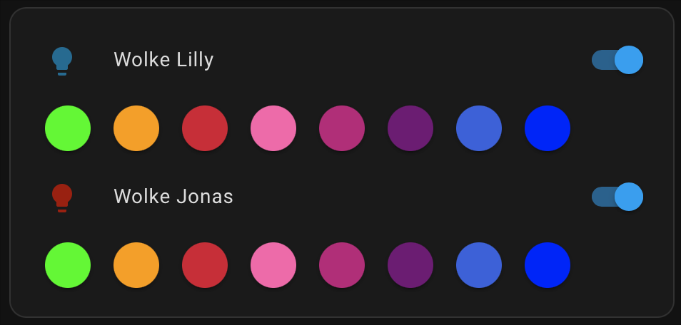

## Blueprints

### 🚶‍♂️💡 Bewegungsmelder Außenlicht

## Dashboard Examples

| Bild                                          | Code                                       | Repo                                                      | 
|:----------------------------------------------|:-------------------------------------------|:----------------------------------------------------------|
|  | [rgb-light-card.yaml](rgb-light-card.yaml) | [RGB Light Card](https://github.com/bokub/rgb-light-card) | 
| Cell 1                                        | Cell 2                                     | Cell 3                                                    | 
| Cell 1                                        | Cell 2                                     | Cell 3                                                    | 