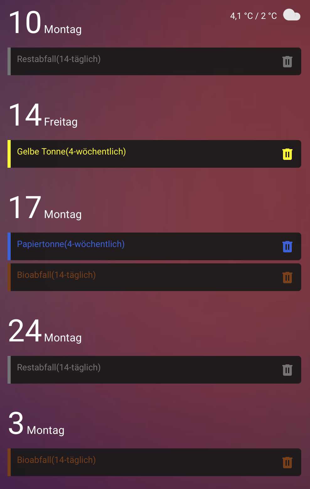

## Blueprints

### 🚶‍♂️💡 Bewegungsmelder Außenlicht

### 🔋⚡️💡 Erkennung & Benachrichtigung bei niedrigem Batteriestand für alle Batterie-Sensoren 📢⚠️
#### Überprüft regelmäßig alle Sensoren mit der Geräteklasse 'battery', ob sie einen bestimmten Schwellenwert unterschreiten, und führt dann eine Aktion aus.

## Dashboard Examples

| Bild                                                                         | Code                                             | Repo                                                      | 
|:-----------------------------------------------------------------------------|:-------------------------------------------------|:----------------------------------------------------------|
|                                 | [rgb-light-card.yaml](rgb-light-card.yaml)       | [RGB Light Card](https://github.com/bokub/rgb-light-card) | 
|                           | [week-planner-card.md](week-planner-card.md)     |     [week-planner-card](https://github.com/FamousWolf/week-planner-card)                                                      |  [week-planner-card.md](week-planner-card.md)