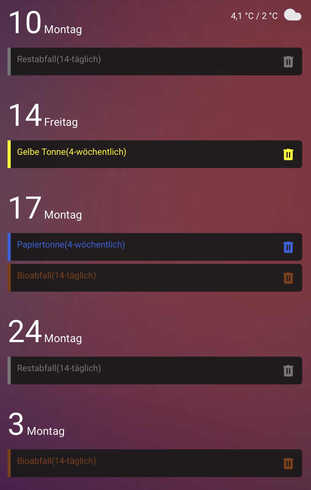

# 🗑️ Home Assistant – Abfalltermine farblich hervorheben (week-planner-card)

## 🎨 Ziel:
Mit der [week-planner-card](https://github.com/FamousWolf/week-planner-card) können Kalender-Einträge für Müllabfuhr **farblich hervorgehoben** werden, sodass z. B. Bioabfall braun, Gelbe Tonne gelb und Restmüll schwarz dargestellt wird.

---

## ✅ **Voraussetzungen**
- Die [week-planner-card](https://github.com/FamousWolf/week-planner-card) muss installiert sein.
- Die Abfalltermine müssen als **Kalender-Entität** (`calendar.abfuhrtermine`) in Home Assistant vorhanden sein.
- **Card-Mod** muss installiert sein (über HACS verfügbar).
- **WICHTIG:** Falls dein Abfallkalender andere Bezeichnungen verwendet (z. B. "Restmüll" statt "Restabfall"), **müssen die `data-summary`-Werte im Code angepasst werden!**  


---

## 🎨 **Farbige Darstellung für verschiedene Mülltypen**
Füge den folgenden Code in die **Lovelace YAML-Konfiguration** deiner `week-planner-card` ein, um die Farben automatisch anzupassen:

```yaml
card_mod:
  style: |
    /* Bioabfall → Braun */
    .container .day .events
    .event[data-entity="calendar.abfuhrtermine"][data-summary*="Bioabfall"] {
      border-color: saddlebrown;
      .title {
        color: saddlebrown;
      }
      .icon {
        color: saddlebrown;
      }
    }

    /* Gelbe Tonne → Gelb */
    .container .day .events
    .event[data-entity="calendar.abfuhrtermine"][data-summary*="Gelbe Tonne"] {
      border-color: yellow;
      .title {
        color: yellow;
      }
      .icon {
        color: yellow;
      }
    }

    /* Restabfall → Schwarz */
    .container .day .events
    .event[data-entity="calendar.abfuhrtermine"][data-summary*="Restabfall"] {
      border-color: grey;
      .title {
        color: grey;
      }
      .icon {
        color: grey;
      }
    }

    /* Papiertonne → Blau */
    .container .day .events
    .event[data-entity="calendar.abfuhrtermine"][data-summary*="Papiertonne"] {
      border-color: RoyalBlue;
      .title {
        color: RoyalBlue;
      }
      .icon {
        color: RoyalBlue;
      }
    }
    
    /* Bei Ganztägigen Terminen wird die Zeit ausgeblendet */
    .container .day .events .event[data-start-hour="0"][data-end-hour="0"] .time {
      display: none;
    }
    
```
   
   